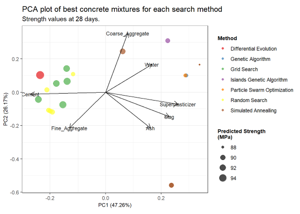
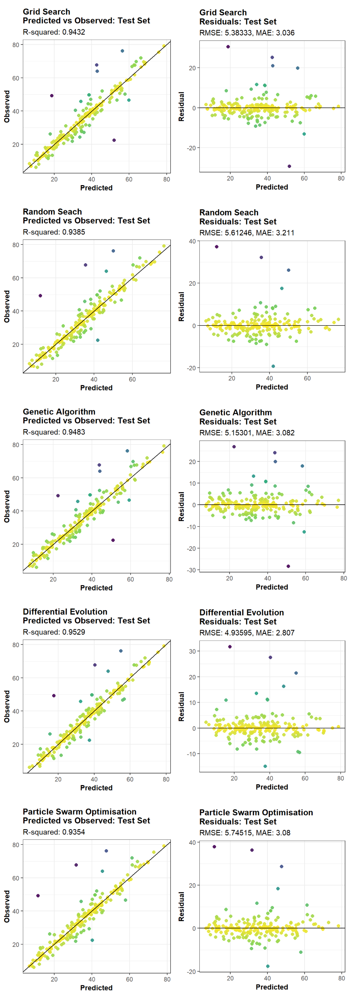
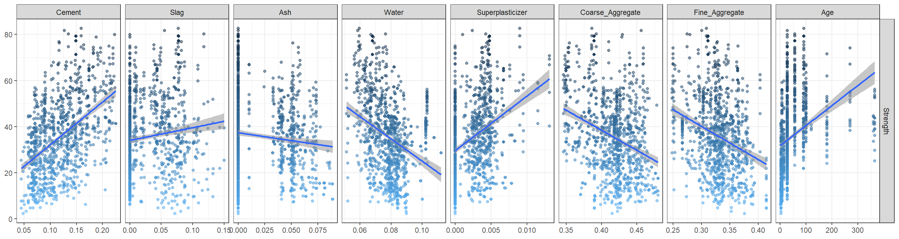

# Exploring the Use of Modern Search Methods in R for Hyperparameter Tuning of a XGBoost model and Maximizing the Compressive Strength of Concrete

This project has two main objectives:  

1.[**Search Methods for function optimization:**](https://rpubs.com/jeandsantos88/Concrete_Mixture_Optimization) Compare various search methods to find a concrete mixture with the highest predicted compressive strength.
   
The PCA plot below shows that there are some differences between solutions provided by each search method. Solutions with higher strength leverage the use of cement for obtaining higher predicted compressive strengths.
   

   
The solution obtained with differential evolution had the highest predicted strength and based on the PCA plot above it composition is similar to the composition of solutions obtained grid and random search.

You can access the output of the analysis through the article on RPubs: [https://rpubs.com/jeandsantos88/Concrete_Mixture_Optimization](https://rpubs.com/jeandsantos88/Concrete_Mixture_Optimization)

***

2.[**Search Methods for hyperparameter tuning:**](https://rpubs.com/jeandsantos88/search_methods_for_hyperparameter_tuning_in_r) Test various search methods to tune the hyperparameters of a XGBoost models that predicts the compressive strength of concrete.

The objective of this document is to assess the use of various search methods in finding the optimal values of hyperparameters of a machine learning model. The population-based search methods to be tested are genetic algorithms (GA), differential evolution (DE) and particle swarm optimization (PSO). Grid and random search will also be performed and used as benchmarks.

XGBoost with generalized linear models as learners was used to predict the compressive strength of concrete based on its composition. The compressive strength of concrete is determined by its age and composition.

The use of population-based search methods such as genetic algorithms, differential evolution and particle swarm optimation showed some potential for finding the optimal values of hyperparameters of regression models.

The use of Differential Evolution resulted on the lowest test set RMSE value of all the methods tested.

Due to the high computational demands, the use of these methods may be more suitable for models with several hyperparameters used on relatively small datasets and/or models that are easily trained. Performing a grid search across a wide range of values for beforehand may also help to narrow the limits of the constraints and make the overall process more efficient.

You can access the output of the analysis through the article on RPubs: [https://rpubs.com/jeandsantos88/search_methods_for_hyperparameter_tuning_in_r](https://rpubs.com/jeandsantos88/search_methods_for_hyperparameter_tuning_in_r)

## Search Methods

Seven search methods are tested for the optimisation of the concrete mixture:  

- Grid search (GS)
- Random search (RS)
- Simulated Annealing (SA)
- Genetic algorithm (GA)
- Islands genetic algorithm (ISLGA)
- Differential evolution (DE)
- Particle swarm optimization (PSO)

Grid and random search will be used as benchmarks for comparing the other search methods.

***

## Data

The dataset used to train the predictive model comes from the research paper [*Modeling of strength of high performance concrete using artificial neural networks*](https://www.sciencedirect.com/science/article/pii/S0008884698001653) by I-Cheng Yeh published in *Cement and Concrete Research*, Vol. 28, No. 12, pp. 1797-1808 (1998). The compressive strength of concrete was predicted using its age and composition. 

The dataset can be downloaded through the [UCI Machine learning Repository](http://archive.ics.uci.edu/ml/datasets/Concrete+Compressive+Strength). The final model was tuned using the [`caret`](https://topepo.github.io/caret/index.html) package. 

The data contains 1030 examples and the following features:

* Input Variable: Cement (kg in a m^3 mixture)
* Input Variable: Blast Furnace Slag (kg in a m^3 mixture)
* Input Variable: Fly Ash (kg in a m^3 mixture)
* Input Variable: Water (kg in a m^3 mixture)
* Input Variable: Superplasticizer (kg in a m^3 mixture)
* Input Variable: Coarse Aggregate (kg in a m^3 mixture)
* Input Variable: Fine Aggregate (kg in a m^3 mixture)
* Input Variable: Age (days)
* Output Variable: Concrete compressive strength (MPa)

***
## Questions and Feedback

For questions or feedback please contact me via [LinkedIn](https://www.linkedin.com/in/jeandsantos/) or [email](mailto:jeandsantos88@gmail.com?subject=Questions%20and%20Requests).
